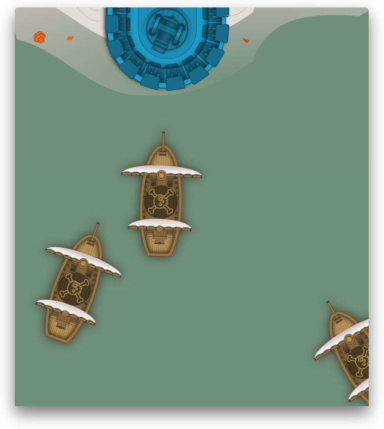

# Don't Let the Pirates Win

A toy TypeScript/React application that's neither a counter (though it has one)
_or_ a TODO list (it has one of those, too).

<p align="center">
  
</p>

## Demo

Play [in your browser](http://tspirates.surge.sh/)!

## Building

Install and build the demo application:

```sh
$ npm install
$ npm start
```

## Contributing

So many improvements, so little time! Beyond any open issues, here are some
ideas to get you started:

  - Clean up collision detection API
  - Separate "world-time" from clock frequency (i.e., use variable `dt`)
  - Different types of ships, or "ship health" (multiple shots needed to sink)
  - Use a real physics engine (or expand our model to allow for mass, force, and
    momentum)
  - Show animations when something's hit (explosions? Sinking ships?)
  - Animate water (tide, ship wakes, projectile splashes, etc.)
  - Replace HTML/CSS rendering with another rendering engine
  - Clean up message console typography, UI

## License

MIT
